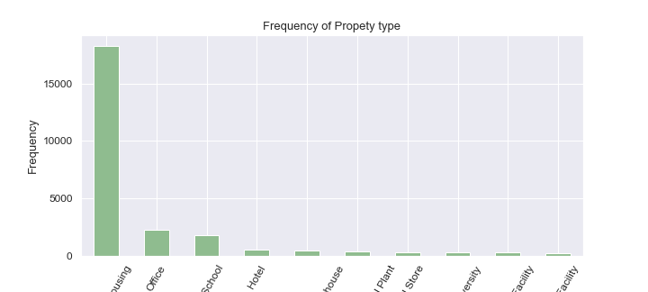
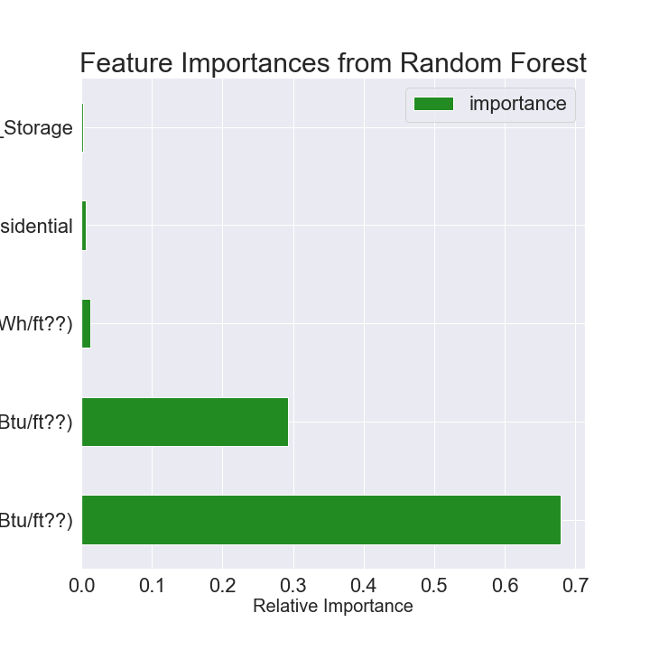

# The_Concrete_Jungle_Machine Learning Project
**LL84 Greener, Greater Buildings Plan for NYC**

>**[Introduction](#Introduction)**

>**[Exploratory Data Analysis](#Exploratory-Data-Analysis)**

>**[Feature Relationships](#Feature-Relationships)**

>**[Correlations with Target Variable](#Correlations-with-Target-Variable)**

>**[Feature Engineering and Selection](#Feature-Engineering-and-Selection)**

>**[Machine Learning Model](#Machine-Learning)**

>**[Model Optimization](#Model-Optimization)**

>**[Model Interpretation](#Model-Interpretation)**

>**[Extra Work](#Extra_Work)**

>**[Conclusions](#Conclusions)**

## Introduction

I started this project with a goal of taking the 2021 NYC Benchmarking Law building energy usage data and do something with it. I originally attempted to clean and analyze this data set to try to find ways to reduce buildings' energy usage and subsequently their green house gas emissions. After a few iterations I thought it might be interesting to see if I could predict the buildings ENERGY STAR score by looking at their age, energy and water consumption as well as other energy consumption metrics.

At a high level, the purpose of this project is to explore the dataset, perform first order statistical analysis, and develop a model for prediction/classification. The dataset contains independent variables that might be used to infer interesting facts about buildings in New York. Of primary interest is the ENERGY STAR score, since this score is used as an aggregate measure of a building's energy performance.

Our main questions to answer will be:

> * Does this dataset contain a set of independent variables that correlate to the ENERGY STAR rating?
> * For buildings without ENERGY STAR scores, can you inter what their score might be?

Our main tasks to concur will be:

> * Regress the data to predict the numeric score - or bin the scores into grades and apply a classifier.
> * Cluster buildings to determine if similar groups exist.

### Data
The NYC Benchmarking Law requires owners of large buildings to annually measure their energy and water consumption in a process called benchmarking. The law standardizes this process by requiring building owners to enter their annual energy and water use in the U.S. Environmental Protection Agency's (EPA) online tool, ENERGY STAR Portfolio Manager and use the tool to submit data to the City. This data gives building owners information about a building's energy and water consumption compared to similar buildings, and tracks progress year over year to help in energy efficiency planning.

There are about 29,842 buildings with 249 different types of energy usage, emissions and other information. Even though we don't understand the meanings of all 249 columns or features this isn't a huge concern because we let the model decide which features are important. Nonetheless, it would be helpful to understand the problem to the extent as possible, and because we also want to interpret the model results, it would be a good idea to have some knowledge of the columns.

## Exploratory Data Analysis
Exploratory Data Analysis (EDA) is an open-ended process when we make visualizations and statistics to explore and understand the data. The purpose is to find anomalies, patterns, trends, or relationships. The process generally starts out with a high-level overview, and then narrows down in to specific parts of the dataset.

Features Explored
> * ENERGY STAR Score (Target Variable)

> * Site EUI 
> * Property Type

> * Boroughs

## Feature Relationships
In order to determine if certain property types tend to score better or worse on the Energy Star Score, we can plot the distribution of energy star scores by property type. Following is a density plot showing the distribution of scores for property types with more than 100 measurements in the data.

## Correlations with Target Variable
Let's take a look at the Pearson Correlation Coefficient between all the numerical columns and the Energy Star Score. This measures the linear relationship between two variables, and it might shed some light on what features are related to the Energy Star Score.

## Feature Engineering and Selection
Now that we have explored the trends and relationships within the data, we can work on engineering a set of features for our models. We can use the results of the EDA to inform this feature engineering. In particular, we learned the following from EDA which can help us in engineering/selecting features:

> * The score distribution varies by property type and to a lesser extent by borough. Although we will focus on numerical features, we should also include these two categorical features in the model.
> * Taking the log transformation of features does not result in significant increases in the linear correlations between features and the score

## Machine Learning Model
The objective is to predict the Energy Star Score of a building given the variables available in the data. First, we will separate out the buildings that have a score and those without for later inference. Of the buildings with an Energy score, we will use 70% for training the model and 30% for evaluating our model.

### Machine Learning Approach
> 1. Data cleaning and formatting
> 2. Exploratory data analysis
> 3. Feature engineering and selection
> 4. Establish a baseline and compare several machine learning models on a performance metric
> 5. Perform hyperparameter tuning on the best model to optimize it for the problem
> 6. Evaluate the best model on the testing set
> 7. Interpret the model results to the extent possible
> 8. Draw conclusions

## Models

## Model Optimization
In machine learning, optimizing a model means finding the best set of hyperparameters for a particular problem.

## Model Interpretation
Machine learning is often criticized as being a black-box: we put data in on one side and it gives us the answers on the other. While these answers are often extremely accurate, the model tells us nothing about how it actually made the predictions. This is true to some extent, but there are ways in which we can try and discover how a model thinks.

## Extra Work
> 1. Predicting Missing Target Values
> 2. Classification of Target Values

## Conclusions
The highlights from the report are:

> * Energy Star Score might not be the most accurate measure of a buildings overall energy efficiency
> * Disproportionate number of buildings have either 1 or 100 energy star scores
> * Site EUI is more normally distributed and might be a more objective measure
> * Regression and Classification both are able to produce reasonable predictions for Energy Star Score
> * The most useful random forest features for predicting Energy Star Score are EUI, Property Type, and Electricity usage
> * Finally I was able to classify the buildings into 5 grades as well as predict the score of buildings with missing scores.

## Repository

├── images          
├── notebook                              
├── presentation                                
├── LICENSE
└── README.md

